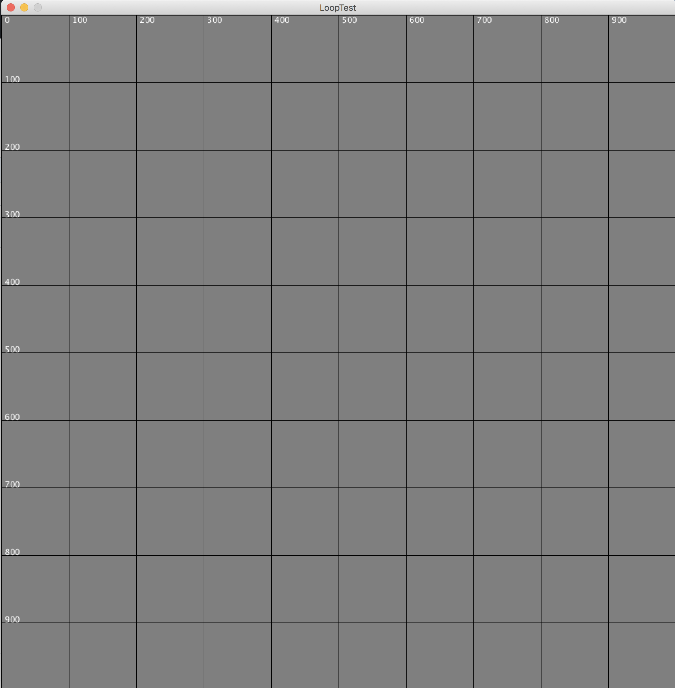
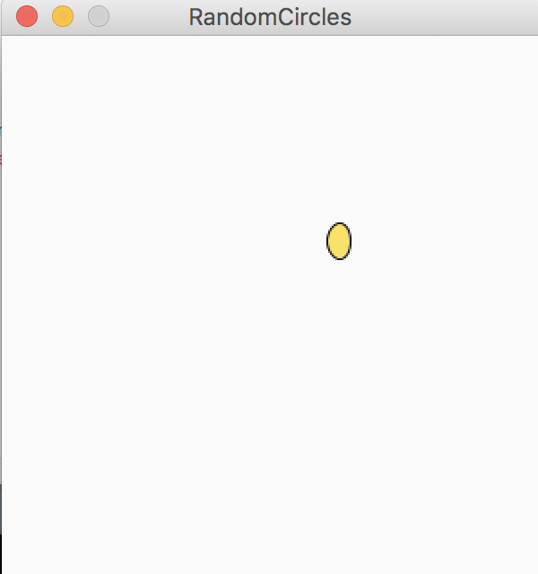
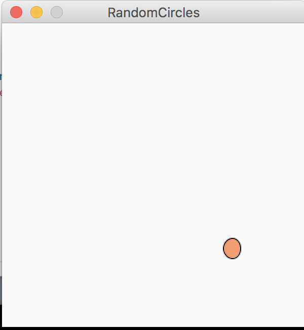

# Welcome to Janne Wald's Programming Portfolio
All from the programming class of 2018-19

Buisness email: janne.l.wald@gmail.com

## Shapes

__Completed 8/31/2018__
*Processing IDE was used

This project demonstrates the basic methods of creating a frame by using size(); and drawing methods like rect(); ellipse(); triangle(); quad(); and also the descriptive methods like fill();

[I'm an inline-style link](https://www.google.com)

[Source code used](https://github.com/JanneWald/2018-19ProgramingPortfolio/blob/master/Projects/Term1/Shapes)

local Source Code: Projects/Term1/Shapes

## Loops

__Completed 9/25/2018__
*Processing IDE was used

This project deminstrates the simple use of a "for" loop

Source Code: https://github.com/JanneWald/2018-19ProgramingPortfolio/blob/master/Projects/Term1/Loops

## Collision Detection

__Completed 9/30/2018__
*Processing IDE was used

This project applies the use of detecting bounds and then changing position variables acording to the scenario.

Source Code: https://github.com/JanneWald/2018-19ProgramingPortfolio/blob/master/Projects/Term1/Collision%20Detection

## Random Circles

__Completed 9/17/2018__
*Processing IDE was used

This project uses the random() function inside of methods by aplying it to circle width while using mouseX mouseY variables.

Source Code: https://github.com/JanneWald/2018-19ProgramingPortfolio/blob/master/Projects/Term1/Collision%20Detection

## Timeline

__Completed 9/7/2018__
*Processing IDE was used

This project utilized if statements in a changing background to make words appear according to mouse position

Source Code: https://github.com/JanneWald/2018-19ProgramingPortfolio/blob/master/Projects/Term1/timeline

## Speed conversion

__Completed 12/10/2018__
*Processing IDE was used

This project creates methods that allows an interactive calculator for miles to kilometers and vice versa.

Source Code: https://github.com/JanneWald/2018-19ProgramingPortfolio/blob/master/Projects/Term1/convert

## Make a Face

__Completed 9/17/2018__
*Processing IDE was used

This project uses controlled elements of random to generaet random faces and saves them in your folders.

Source Code: https://github.com/JanneWald/2018-19ProgramingPortfolio/blob/master/Projects/Term1/face

## More random loops

__Completed 9/17/2018__
*Processing IDE was used

This project uses other loops to create random box and line shadings to create some odd image.

Source Code: https://github.com/JanneWald/2018-19ProgramingPortfolio/blob/master/Projects/Term1/loops3

## Etch-a-sketch

__Completed 12/21/2018__
*Processing IDE was used

This project takes in inputs of your arrow keys and then uses them for draw commands.

Source Code: https://github.com/JanneWald/2018-19ProgramingPortfolio/blob/master/Projects/Term1/sketch

## Screen Saver

__Completed 10/24/2018__
*Processing IDE was used

This project uses several instances of for loops and percentage values to generate random lines similar to the "tubes screen saver for windows"

Source Code: https://github.com/JanneWald/2018-19ProgramingPortfolio/tree/master/Projects/Term1/ScreenSaver

## Temperature converter

__Completed 8/24/2018__
*Processing IDE was used

This project is a simple interactable application that runs mouseX through a method to get the other temperature conversion from Farenheit and Celcius.

Source Code: https://github.com/JanneWald/2018-19ProgramingPortfolio/blob/master/Projects/Term1/tempConvert

## Calculator

__Completed 12/3/2018__
*Processing IDE was used

This project is a  interactable application that looks and function like a standard calculator

Source Code: https://github.com/JanneWald/2018-19ProgramingPortfolio/blob/master/Projects/Term1/calc

## 99 Bottles of ...

__Completed 1/23/2019__
Java Eclipse IDE was used

This project uses our recently assigned java language, to manipulate "for" loops into  displaying the well know 99 bottles song in the console.

Source Code: https://github.com/JanneWald/2018-19ProgramingPortfolio/blob/master/Projects/Term3/99%20Bottles

## Guessing Game

__Completed 2/01/2019__
*Java Eclipse IDE was used

This project uses our recently assigned java language to create if statements that give hints to the player if they are getting closer or colder to the correct number.

Source Code: https://github.com/JanneWald/2018-19ProgramingPortfolio/blob/master/Projects/Term3/guessingGame

## Pig latin translator

__Completed 2/06/2019__
*Java Eclipse IDE was used

This project uses newly assigned java language to utilize the character scanner function within eclipse. This allows you to insert any word that will be translated into the pig latin equivalent. To translate a word in pig latin, one must take the first letter of the word, bring it to the back of the word, and add -ay at the end. I had some help with the capitalization code using https://introcs.cs.princeton.edu/java/31datatype/Capitalize.java.html.

Source Code: https://github.com/JanneWald/2018-19ProgramingPortfolio/blob/master/Projects/Term3/igpay

## Age calculator

__Completed 2/18/2019__
*Java Eclipse  was used

This project uses our assigned java language to create an age calculater using the get.date functions within eclipse and compare your inputs to the current date. 

Source Code: https://github.com/JanneWald/2018-19ProgramingPortfolio/blob/master/Projects/Term3/time

## Group Project: Word creator 

__Completed 2/18/2019__
*Java Eclipse IDE was used

This project uses our assigned java language to create an age calculater using the get.date functions within eclipse and compare your inputs to the current date. 

Source Code: https://github.com/JanneWald/2018-19ProgramingPortfolio/blob/master/Projects/Term3/time
